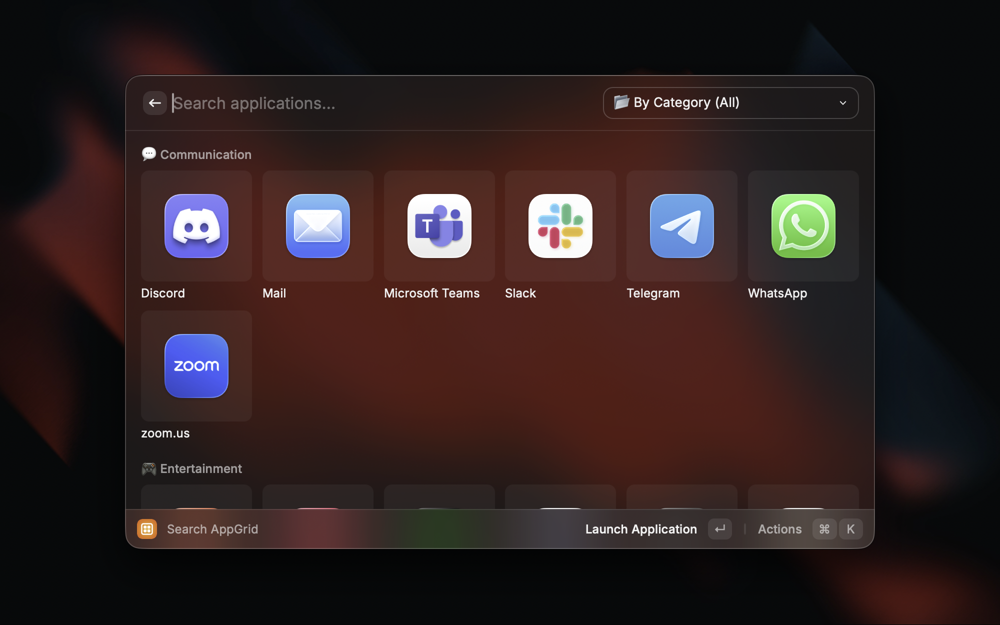
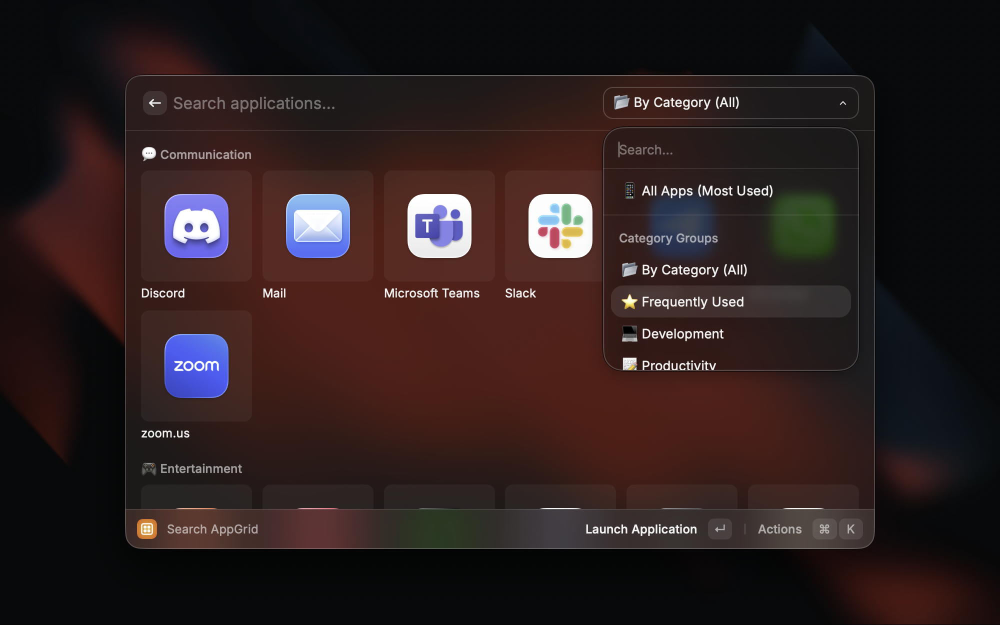
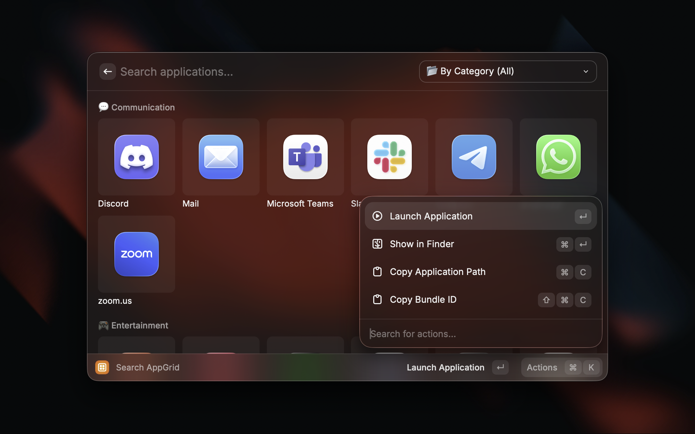

# AppGrid

Smart app launcher for macOS with grid view and intelligent category grouping.

## Features

- **Grid View**: Beautiful grid layout for all your applications
- **Smart Categories**: Automatically organizes apps into:
  - Frequently Used
  - Development
  - Productivity
  - Communication
  - Entertainment
  - Utilities
  - Others
- **Multiple View Modes**:
  - All apps view (sorted by name or usage)
  - Category grouped view
- **Usage Tracking**: Tracks how often you use each app
- **Multi-language Support**: English, Korean, and Japanese
- **Fast Search**: Quickly find any application

## Usage

1. Open Raycast
2. Search for "AppGrid"
3. Browse apps in grid view
4. Use the dropdown menu to filter by category or change view mode
5. Click or press Enter to launch an app

## Screenshots

## Commands

### Search AppGrid

Launch your macOS applications with smart categorization and grid view.

**Actions:**
- Launch Application
- Show in Finder
- Copy Application Path
- Copy Bundle ID

## Preferences

AppGrid automatically detects your system language and adjusts the interface accordingly.

## Author

Created by [Jungwoon Park](https://www.linkedin.com/in/jungwoon-park/)

## License

MIT
