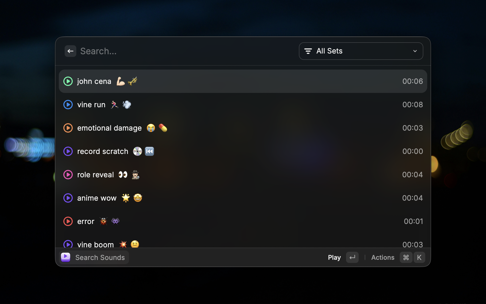
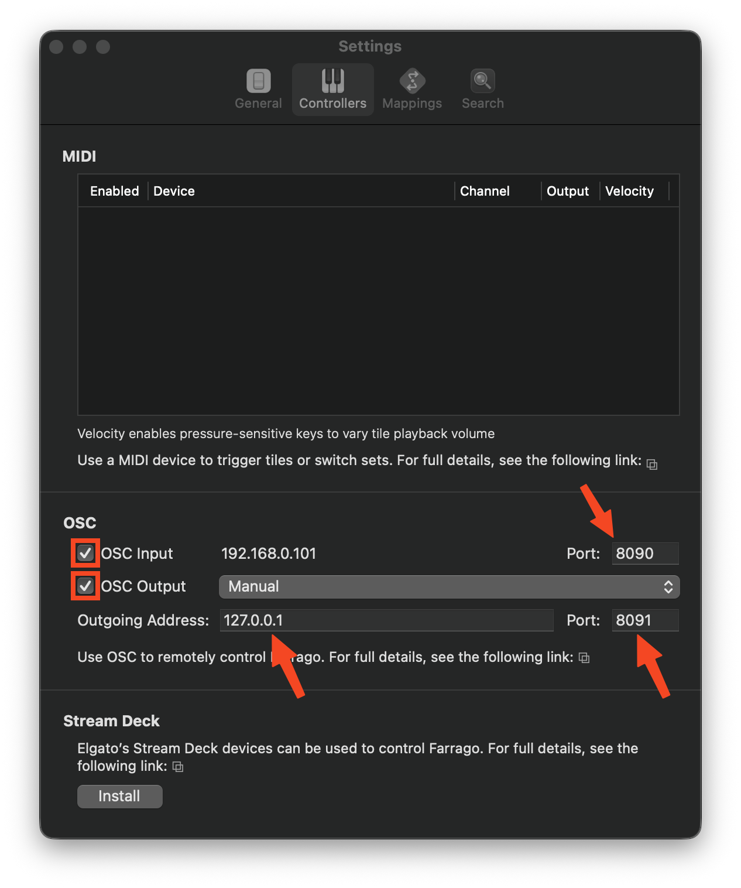

# Farrago

### About

This extension allows you to interact with all the sounds you have in Farrago (a soundboard app).

### Prerequisites

1. Have [Farrago](https://rogueamoeba.com/farrago/) installed.
2. Configure OSC in Farrago. The settings should match the extension settings. In most cases, the screenshot below will work fine, combined with the default extension settings.

3. Ensure that the folder `~/Library/Application Support/Farrago 2` exists on your machine (it probably does). If not, locate Farrago's data directory and set its path in the extension settings.

### Global keyboard shortcuts to play sounds

To be able to play a specific sound with a keyboard shortcut, execute the "Add Shortcut" action while focused on a sound in the "Search" command. This will add an Apple Shortcut which contains further instructions (they're few and simple).
