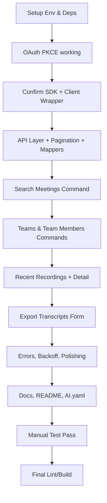

# Raycast Fathom Extension Plan

This document provides a structured overview of the implementation plan, milestones, and risks.

## Mind Map

```mermaid
mindmap
  root((Raycast Fathom Extension))
    1) Scope & Assumptions
      Commands
        search-meetings
        search-teams
        search-team-members
        search-recordings
        export-transcripts
        "later: unified command"
      Export
        default: md
        alt: txt (preference)
        YAML frontmatter meta
      Destination
        Form.FilePicker
        default export dir (pref)
      URLs
        open meeting/recording in browser
        "TODO: confirm URL shape"
      Data model
        recordings ⟶ meetings with recordings
      Filters
        server-side when supported
        client-side fallback (marked)
      OAuth scopes
        "tentative: meetings:read teams:read transcripts:read summaries:read users:read"
        "TODO confirm names"
    2) Repo & Branch
      feature/fathom-oauth-sdk
      placeholders: src/fathom/README.md
      TODO.md
      AI.yaml
      keep WARP.md unchanged
    3) Local Env
      Node LTS via nvm
      Raycast app + CLI
      npm scripts: dev/lint/build
    4) package.json & Deps
      fathom-typescript@0.0.30
      @raycast/api, @raycast/utils
      engines node>=18
      scripts: dev/build/lint/fix-lint/publish/evals
      commands & preferences scaffolded
    5) Scaffold
      src/fathom/* (auth, client, api, mappers, pagination, errors, constants)
      src/types/Types.ts
      src/actions/* (common, meeting, team, member, recording)
      src/commands/* (5 commands)
      top-level README, TODO, AI.yaml
    6) OAuth (PKCE)
      init client
      authorize
      token refresh
      logout
      empty-state Connect action
    7) SDK Client Wrapper
      getFathomApis()
      "TODO: confirm SDK init & basePath"
    8) Integration Layer
      listMeetings(filters, cursor)
      listRecentRecordings()
      listTeams()
      listTeamMembers()
      getMeetingSummary()
      getMeetingTranscript()
      pagination helper
    9) Mappers & Types
      toUiMeeting / toUiTeam / toUiMember
      stable Ui* types
      filter types
    10) Reusable Actions
      Connect / Logout
      MeetingActions (open/copy summary/transcript)
      TeamActions (copy/show members)
      MemberActions (mailto/copy)
    11) Commands (UI)
      Search Meetings
        search + filters + pagination
        debounced query
      Search Teams
      Search Team Members
      Recent Recordings
        detail metadata
      Export Transcripts
        form: dir + format
        writes file w/ YAML (md)
    12) Patterns
      debounce (useDebouncedValue)
      caching (useCachedPromise, keepPreviousData)
      cursor pagination (Load more)
      LocalStorage optional for last filters
    13) Errors & Rate Limits
      normalizeError + toasts
      retry/backoff for 429
      401/403 reconnect flow
    14) Preferences
      OAuth client id/scopes
      defaultMeetingType
      exportDefaultDirectory
      exportFormat
    15) Docs
      src/fathom/README
      top-level README
      screenshots (TBD)
    16) TODOs
      confirm OAuth endpoints & scopes
      replace SDK placeholders
      map server-side filters
      icons, share link for recordings
      persistence for filters
      retry/backoff
      performance for large exports
    17) AI.yaml Evals
      oauth-connect-flow
      search-meetings-filters
    18) Manual Testing
      Auth flow
      Meetings search & filters
      Recordings detail/actions
      Teams → Members navigation
      Export flow & errors
    19) Acceptance Criteria
      OAuth works & persists
      Commands functional
      Types centralized
      Debounce/cache/pagination ok
      Preferences respected
      Docs present
    20) Milestones (Order)
      Env+deps → OAuth → SDK client → API layer → Types/Mappers → Actions → Commands (meetings first) → Recordings → Export → Error polish → Docs → Final lint/build
    21) Risks & Mitigation
      unknown SDK surface → abstraction
      OAuth endpoints/scopes → early confirm
      pagination model → generic helper
      fs permissions → FilePicker flow
      perf → page sizes + keepPreviousData
```

## Flow


