

# Git Client for Raycast <!-- omit from toc -->

Manage your Git repositories from anywhere on your Mac.

## Overview <!-- omit from toc -->

- [Core Features](#core-features)
  - [🚦 Control **working tree** status](#-control-working-tree-status)
  - [🧰 Resolve merge/rebase **conflicts**](#-resolve-mergerebase-conflicts)
  - [🔎 Search in **commits** and **file history**](#-search-in-commits-and-file-history)
  - [↪️ Checkout, cherry-pick, rebase, reset, revert, and merge on commit, branch, tag](#️-checkout-cherry-pick-rebase-reset-revert-and-merge-on-commit-branch-tag)
  - [🌳 Manage **branches**, **tags**, and multiple **remotes**](#-manage-branches-tags-and-multiple-remotes)
  - [📦 Save and apply **stashes** and **patches**](#-save-and-apply-stashes-and-patches)
  - [📥 Clone repositories from a URL **in the background**](#-clone-repositories-from-a-url-in-the-background)
- [Extra Features](#extra-features)
  - [🔗 Issue Link Detection](#-issue-link-detection)
  - [✨ Generate **AI commit messages**](#-generate-ai-commit-messages)
  - [🔄 Interactive rebase editor](#-interactive-rebase-editor)
- [Tips \& Tricks](#tips--tricks)
  - [🎛️ Fast Navigation](#️-fast-navigation)
  - [⚡ Quicklink for a specific repository](#-quicklink-for-a-specific-repository)
- [⁉️ FAQ](#️-faq)
- [🧑‍🚀 Future Features](#-future-features)
- [💸 Support for the development](#-support-for-the-development)

## Core Features

### 🚦 Control **working tree** status

- List staged and unstaged files with their status (added, modified, deleted, conflicted, etc.)
- View diff of files

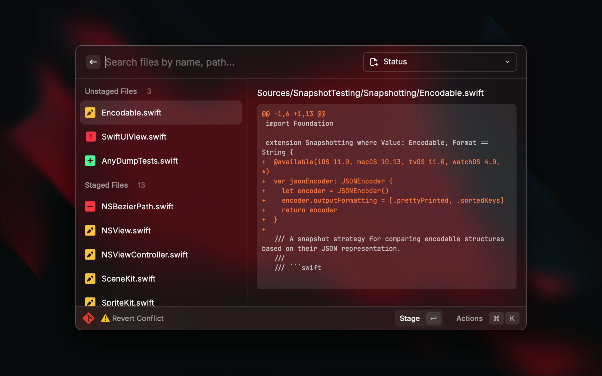

### 🧰 Resolve merge/rebase **conflicts**

- Pick per-segment resolution for merge conflicts

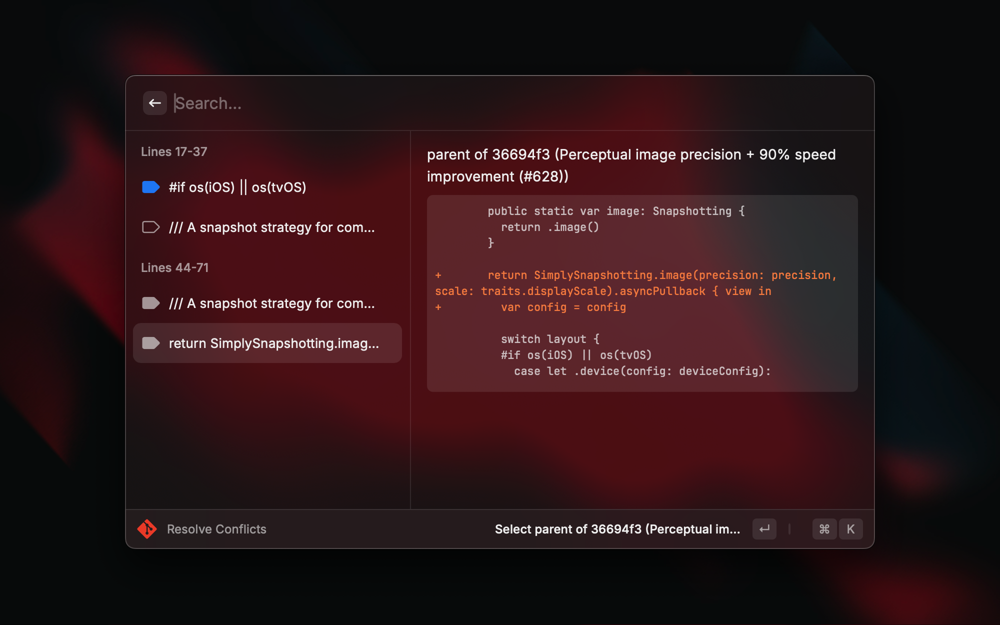

### 🔎 Search in **commits** and **file history**

- Search commit by commit hash, author, message body, creation date, etc.
- View commit history of a specific file

  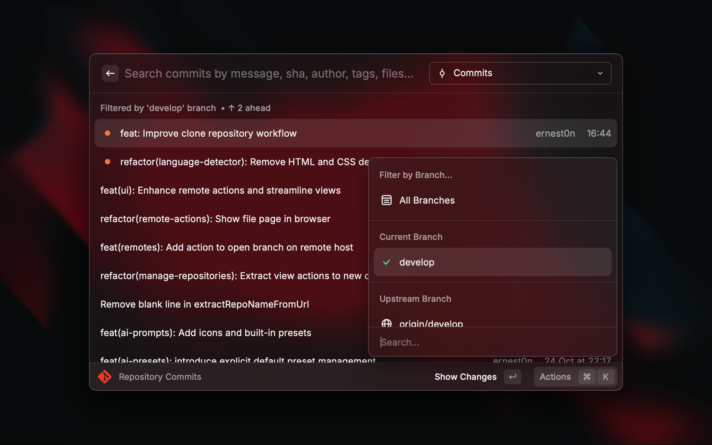
  

### ↪️ Checkout, cherry-pick, rebase, reset, revert, and merge on commit, branch, tag

- Absolutely all the actions you need to change history

  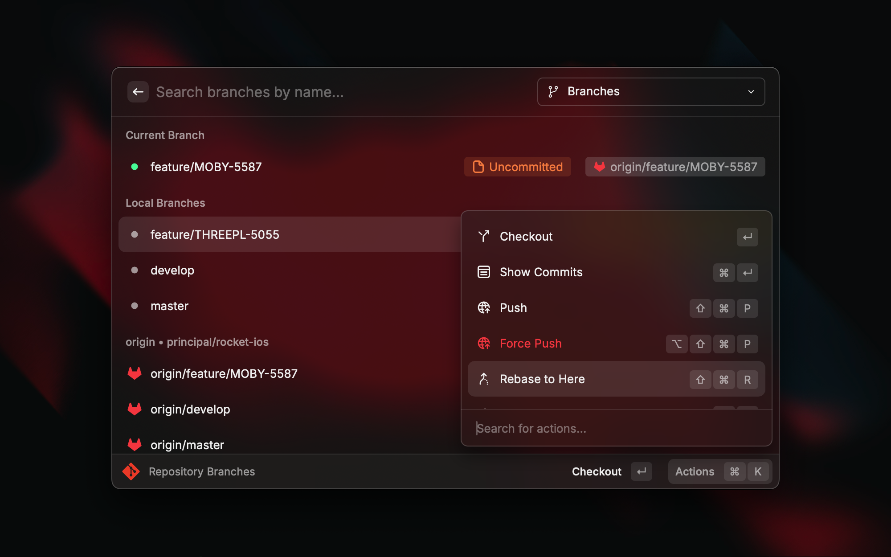
  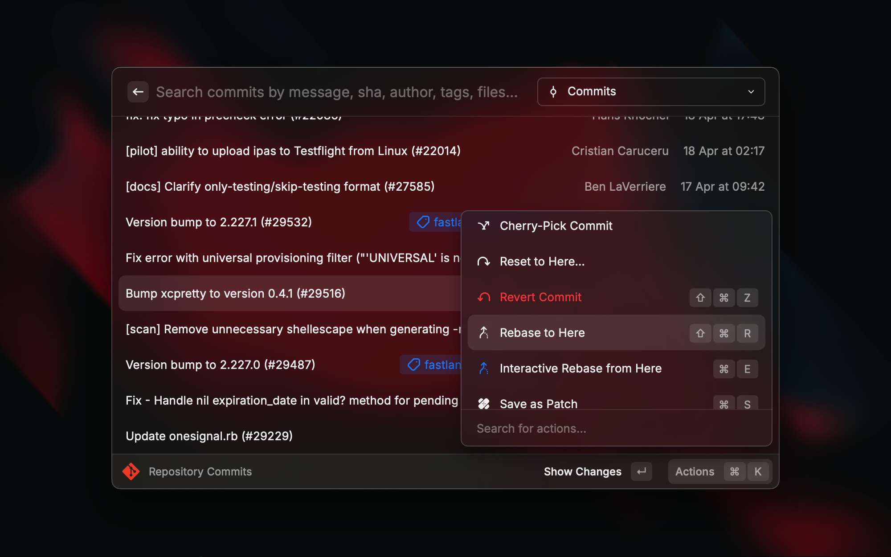

### 🌳 Manage **branches**, **tags**, and multiple **remotes**

- Create, delete, and rename branches and tags
- Set up multiple remotes

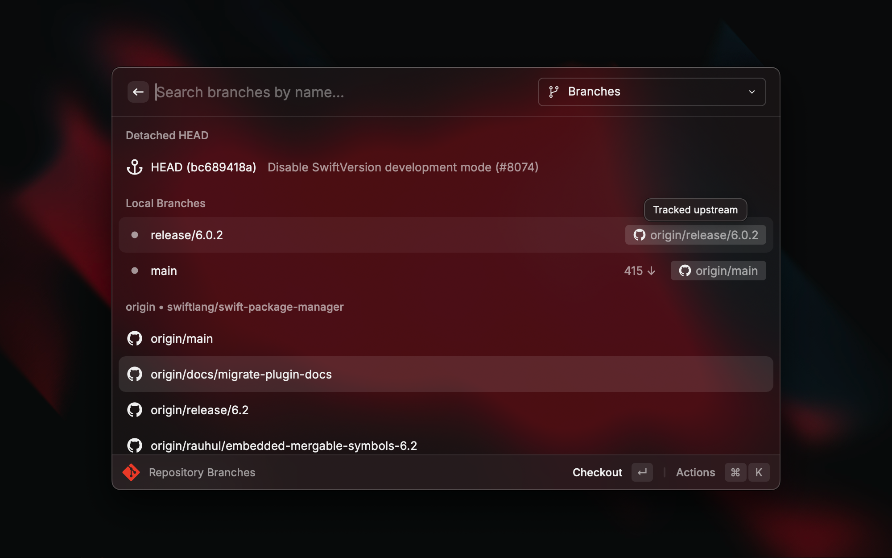

### 📦 Save and apply **stashes** and **patches**

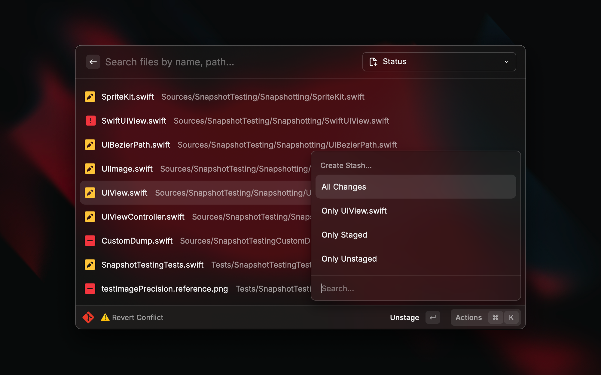

### 📥 Clone repositories from a URL **in the background**

- Quickly clone multiple repositories from a URL over HTTPS or SSH in the background
- Track cloning progress

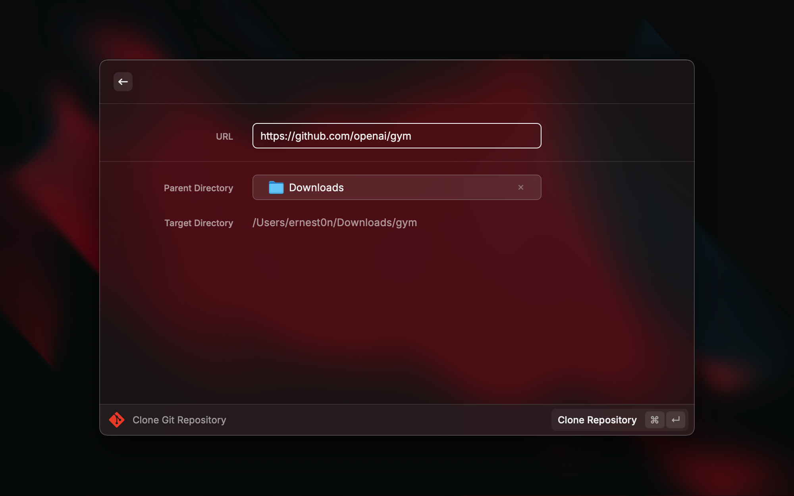

## Extra Features

### 🔗 Issue Link Detection

Detect links based on markers in commit messages and the most common web page shortcuts of the remote host, such as:
- file blame & history
- pull requests
- commit details and builds
- tag release page
- linked `#issue`
- and more...
  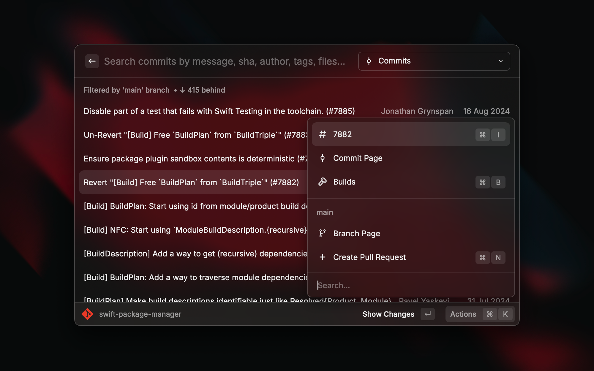

💡 You can also set up custom rules to parse information from commit messages based on regex patterns and create links to specific issue trackers.

1. Run command `Configure URL Trackers` to list all your URL tracker rules.
  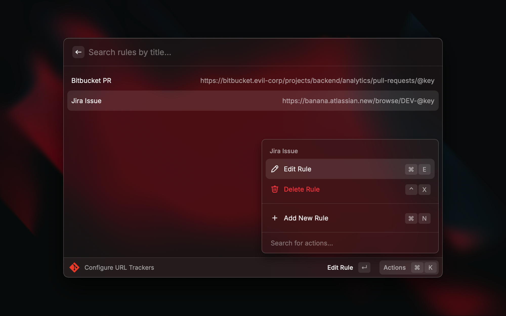

2. Run `Add New Rule` to add a new URL tracker rule and fill in the fields.
  
  - `Regex` should include a capture group for the issue number
  - `URL Template` should contain the `@key` placeholder where the regex match should be inserted

3. Open the `Commits` tab and run the `Attached Links` action to open a submenu with issue links found in commit messages.
  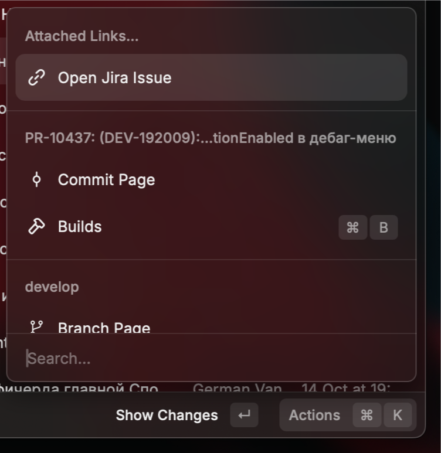{width="50%"}

4. Profit 🎉

---

### ✨ Generate **AI commit messages**

Generate commit messages using AI based on the diff content of the staged changes.

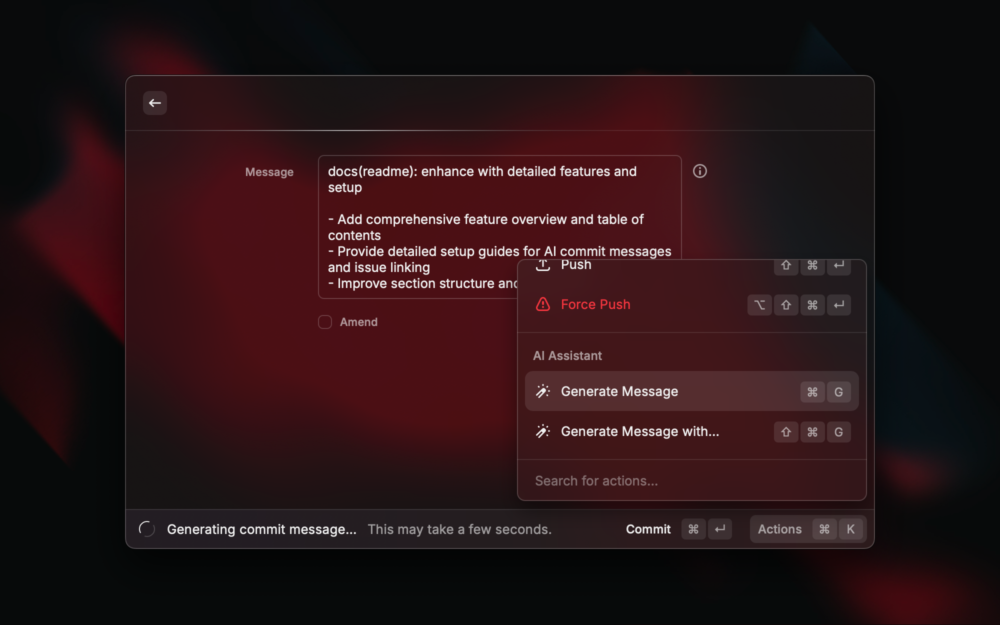

💡 You can also set up custom AI prompts with multiple presets for different styles of commit messages.

1. Run the `Manage AI Message Prompts` command to list all existing AI prompt presets.
  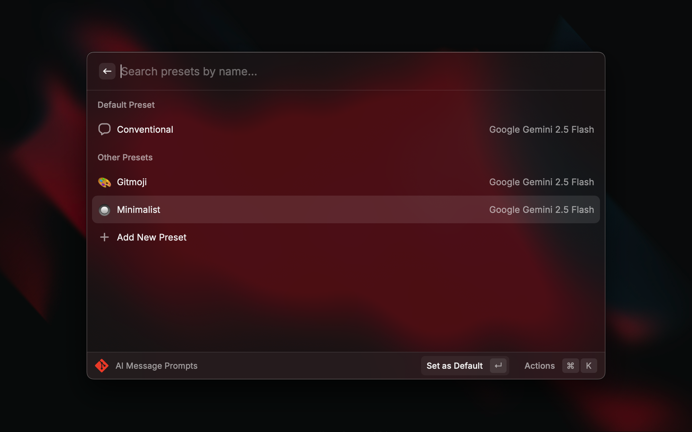

2. Create (`⌘ + N`) or duplicate (`⌘ + D`) an existing preset and edit it to your needs.
  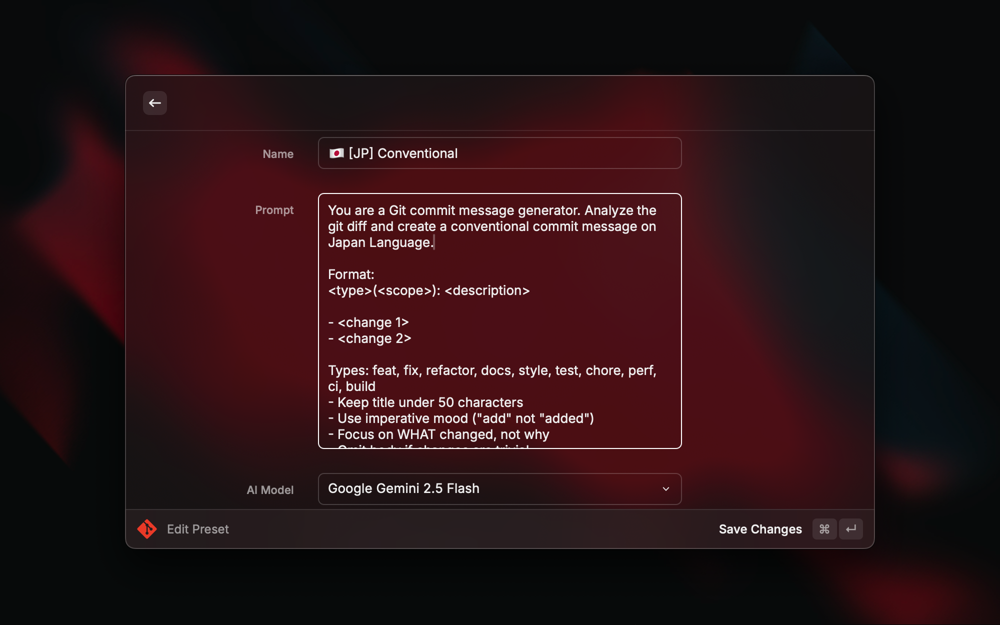

3. Run `Generate Commit Message` (or `⌘ + Shift + G`) and pick your preset from the submenu.
  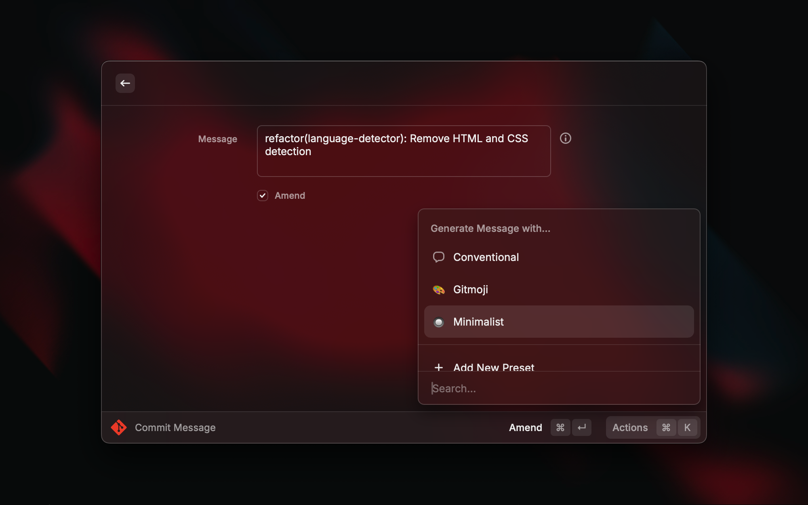

4. Profit 🎉

---

### 🔄 Interactive rebase editor

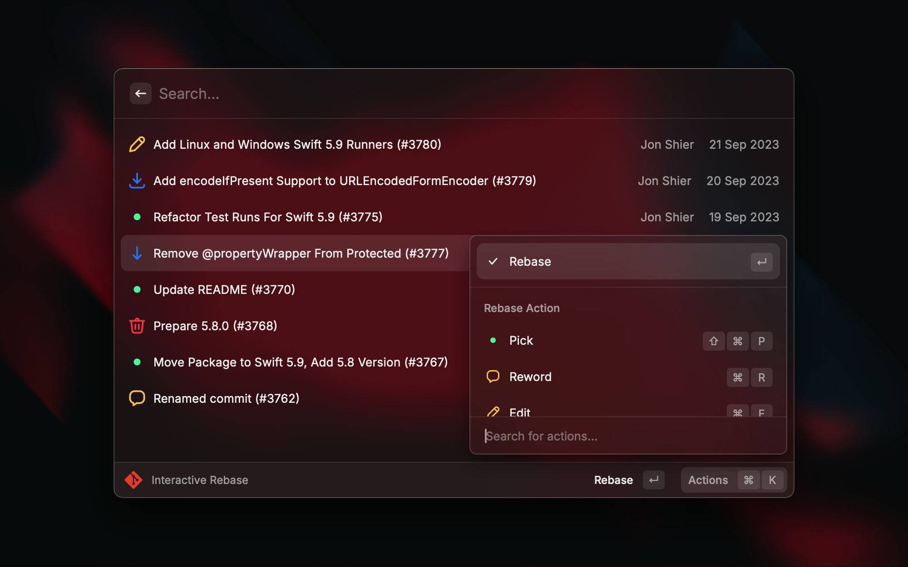

## Tips & Tricks

### 🎛️ Fast Navigation

Use `⌘ + N` to quickly navigate between tabs (aka dropdown items) of the extension.
  - `⌘ + 1` to go to Status
  - `⌘ + 2` to go to Commits
  - `⌘ + 3` to go to Branches
  - `⌘ + 4` to go to Tags
  - `⌘ + 5` to go to Remotes
  - `⌘ + 6` to go to Stashes
  - `⌘ + 0` to go to Files

---

### ⚡ Quicklink for a specific repository

You can create a Quicklink to open a specific repository without needing to select it in the `Manage Git Repositories` list.

1. Run command `Manage Git Repositories` to list all your repositories.
2. Run `Create Quicklink` (or `⌘ + L`) on the repository list item.
3. Profit 🎉

---

## ⁉️ FAQ

> Which environment variables are used when performing Git commands?

The extension loads:
- All environment variables from your interactive Zsh shell.
- `SSH_AUTH_SOCK` from `launchctl` to access the system SSH agent with already set up SSH keys.

## 🧑‍🚀 Future Features

- [ ] AI Tools
- [ ] More fluent commit search
- [ ] Background fetching
- [ ] Menu Bar Commands
- [ ] Submodules support
- [ ] Windows support
- [ ] Manage Hooks
- [ ] Manage Git Config

## 💸 Support for the development

