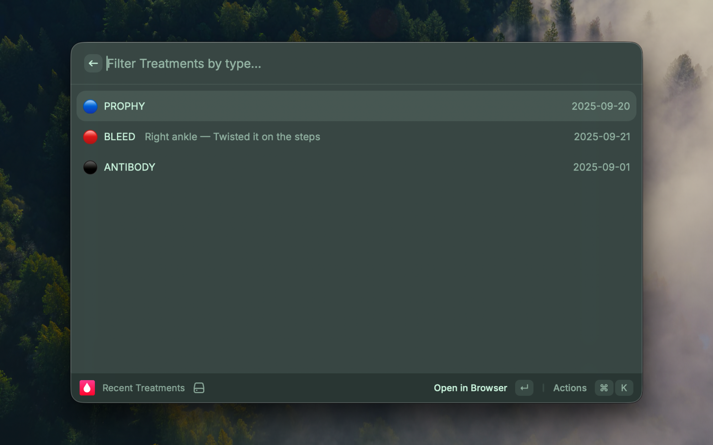
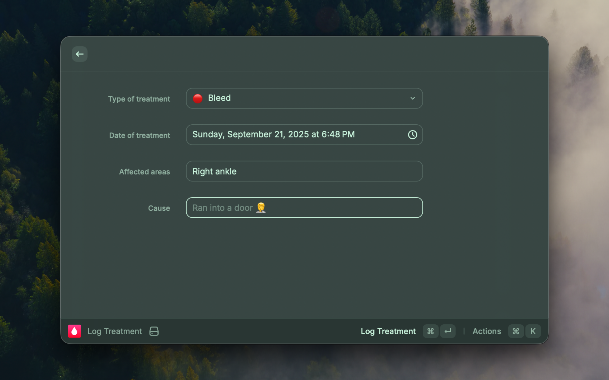

# Hemolog for Raycast

This is a niche extension for people with a genetic bleeding disorder called Hemophilia. Hemolog.com allows you to log your treatments and view statistics over the years to keep you and your medical team on the same page.

Hemolog is free. Sign up at https://hemolog.com. You can find your API key at https://hemolog.com/profile.

The extension includes two commands, **Recent Treatments** and **Log Treatment**.

### Recent Treatments (command)
Display your last three treatments.

### Log Treatment (command)
Log a new treatment including the type, date, bleed location, and reason.

