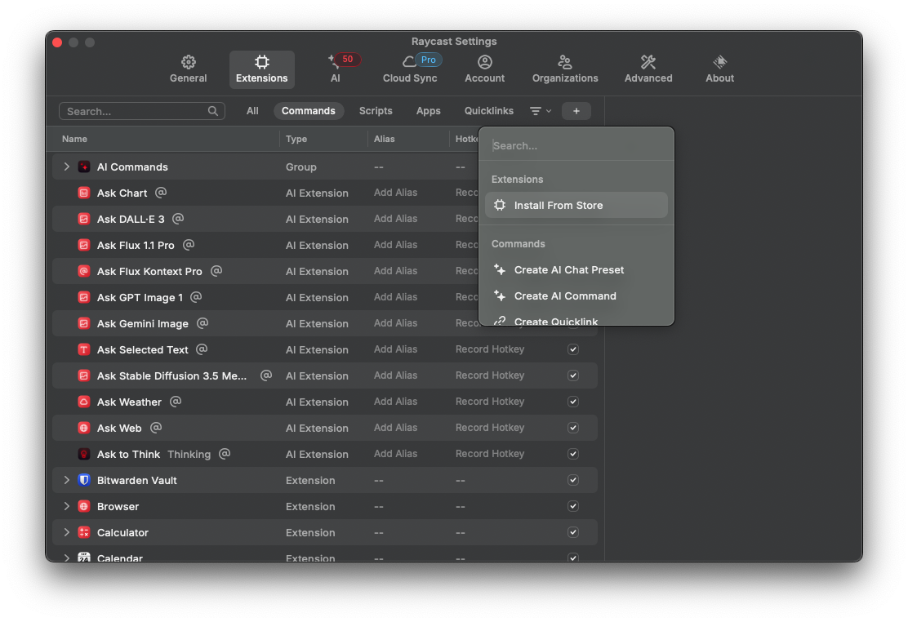
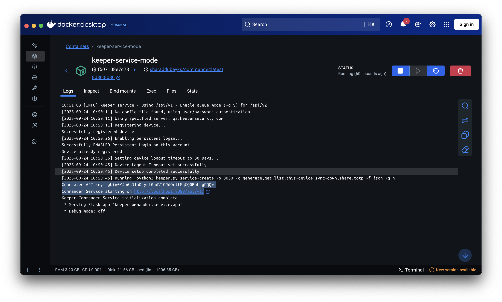
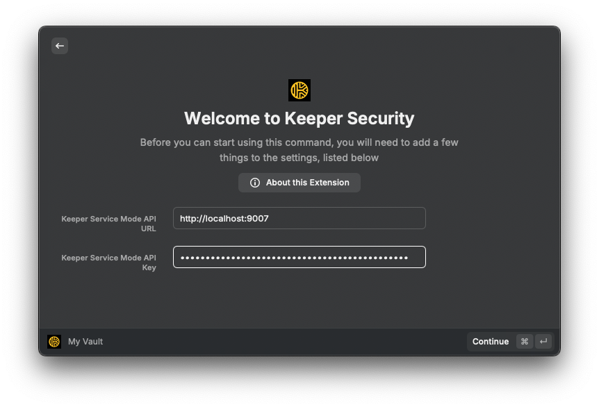

# Keeper Security Raycast Extension


## Table of Contents

- [Overview](#overview)
- [Features](#features)
- [Prerequisites](#prerequisites)
- [Setup](#setup)
- [Usage](#usage)
- [Publishing](#publishing)
- [Troubleshooting](#troubleshooting)
- [Support](#support)
- [License](#license)

## Overview

A comprehensive Raycast extension that provides seamless access to your Keeper Security vault directly to your macOS desktop through Raycast. Manage records, generate secure credentials, and access your vault records without leaving your workflow.

## Features

- **Record Management**: Browse your entire Keeper vault with a clean, searchable, filterable interface and perform different actions
- **Password Generation**: Generate secure passwords with custom options or instantly with defaults, automatically copied to clipboard
- **Passphrase Generation**: Generate 24-word passphrase, automatically copied to clipboard

## Prerequisites

- Keeper Commander CLI: Must be globally installed using binary and authenticated on your system
   - You can install [Keeper Commander](https://docs.keeper.io/en/keeperpam/commander-cli/overview) as a binary, docker container or run from source
   - Authenticated using [Persistent login](https://docs.keeper.io/en/keeperpam/commander-cli/commander-installation-setup/logging-in#persistent-login-sessions-stay-logged-in)
   - Start up the [Commander Service Mode](https://docs.keeper.io/en/keeperpam/commander-cli/service-mode-rest-api) to interact with the local Raycast app

- **Keeper Security Account**: Active subscription with vault access

- **Docker Desktop**: Download & [install docker desktop](https://docs.docker.com/desktop/setup/install/mac-install/) for your system, must be accessible in terminal.

## Setup

### **Install from Raycast Store**:

- Open Raycast Settings
- Go to Extensions → Click `+` button -> `Install From Store`
  
- Search for `Keeper Security`
- Click Install

### Start Keeper Commander Service Mode

In order to preserve zero knowledge and provide all of the full Raycast integration capabilities, you need to run the Keeper Commander service on your local machine, or any server that can be accessed over an HTTPS connection.

Choose the setup option that best fits your Keeper Security account type:

#### **Option 1: KSM Configuration (PAM users Only)**

- Follow the steps under [Using Base64-Encoded KSM Config](https://docs.keeper.io/en/keeperpam/commander-cli/service-mode-rest-api#run-docker-container) method
  in the official Keeper documentation to perform the initial configuration.
- When running the Docker container:
  - Replace the `'<commands>'` placeholder in the `-c `argument with the following command list: <br>
  `"generate,get,list,this-device,sync-down,share,totp,server"` and at the end add `-q n` argument

  **Example**:

  ```bash
  docker run --name keeper-service-mode -d -p 9007:9007 \
  keeper/commander \
  service-create -p 9007 -c "generate,get,list,this-device,sync-down,share,totp,server" -f json \
  --ksm-config XXXXXXXXXXYOUR_BASE64_CONFIGXXXXXXXX \
  --record ABC123-DEF456-GHI789 -q n
  ```

#### **Option 2: Config File Authentication (All Other Users)**

- Follow the steps under [With Config File Authentication](https://docs.keeper.io/en/keeperpam/commander-cli/service-mode-rest-api#run-docker-container) method
  in the official Keeper documentation to perform the initial configuration.
- When running the Docker container:
  - Replace the `/path/to/local/config.json` in the `-v` argument with YOUR_LOCAL_CONFIG_FILE_PATH
  - Replace the `'<commands>'` placeholder in the `-c ` argument with the following command list: <br>
  `"generate,get,list,this-device,sync-down,share,totp,server"` and at the end add `-q n` argument

  **Example**:

  ```bash
  docker run --name keeper-service-mode -d -p 9007:9007 \
  -v /path/to/local/config.json:/home/commander/.keeper/config.json \
  keeper/commander \
  service-create -p 9007 -c "generate,get,list,this-device,sync-down,share,totp,server" -f json \
  -q n
  ```

  > **Note**: If port (eg: **9007**) is already in use, replace all its occurrences with an available port (e.g. **9008**).

### Getting Your API URL and API Key

Once the container starts:

1. Open Docker Desktop.
2. Locate the container named **`keeper-service-mode`**.
3. Click on the container and go to the Logs tab.
4. In the logs, locate and copy the following latest values:
   - Keeper Service Mode **API Key**:<br>
     Look for a log line starting with `Generated API key:` and **copy the value that comes after it** — this is your **API Key**.<br>

   - Keeper Service Mode **API URL**:<br>
     Look for a log line starting with `Commander Service starting on:` and **copy the URL that comes after it** — this is your **API URL**.

     > **Note**: If the API URL includes /api/v1, you can ignore or remove it.

     **Example**: `http://localhost:8080` or your `NGROK URL`.

> **Important**: If the container restarts (e.g. due to a laptop reboot or manual restart), the API key may change.<br>
>
> To retrieve the API key:
>
> - Locate the `Commander Service Mode` record in your Keeper Vault.
> - Download and open the `config.json` file to copy the API key, OR
> - Check the container logs for the newly generated API key.

Example:


### Authenticate the Extension

1. Open **Raycast** using your configured hotkey.
2. Search for **"Keeper Security"** and run any `keeper security` command from the extension.

   If you're not authenticated, the extension will prompt you to enter the **API URL** and **API Key**.

3. Paste the values you copied from the Docker container logs.
4. Click **Continue** to complete the setup.

Example:


> **Note: Need to update preferences later?**
>
> You can update the extension settings anytime:
>
> 1. Open **Raycast Settings** and go to the **Extensions** tab.
> 2. Search for **"Keeper Security"** in the list.
> 3. On the right-side panel, update the required preferences:
>    - **API URL** — Your Keeper Service Mode URL (eg: `http://localhost:8080`)
>    - **API Key** — Your Keeper Service Mode API Key

## Usage

### Open **Raycast** using your configured hotkey to run below commands:

- ### My Vault Command
  - **Purpose**: View and interact with all your vault records.

  - **Available Actions**:
    - **Show Details** - Displays detailed information about the record.
    - **Open in Browser** - Opens the record directly in the Web Keeper Vault via your browser.
    - **Copy Login** – Copies the username/email to clipboard (if available in the record)
    - **Copy Password** – Copies the password to clipboard (if available)
    - **One-Time Share Record** – Generates a 7-day shareable link for the record
    - **Copy Two Factor Code** – Copies the TOTP code (if available)
    - **Sync Records** – Fetches the latest vault records from the server

- ### Generate Password Command
  - **Purpose**: Generate a random password with custom options and automatically copy it to the clipboard.

- ### Generate Password (Quick) Command
  - **Purpose**: Generate a random password using default options and automatically copy it to the clipboard.

- ### Generate Passphrase Command
  - **Purpose**: Generate a random 24-word passphrase and automatically copy it to the clipboard.

## Publishing

- To publish the extension, follow the official Raycast documentation here:<br>
  [Publishing an Extension – Raycast Docs](https://developers.raycast.com/basics/publish-an-extension)

## Troubleshooting

### Common Issues

- **"Authentication failed"**
  - Restart Keeper Service Mode Docker container to get a fresh API key
  - Verify your API key is correct in extension preferences (get the latest key from Docker service mode container logs) <br>

    OR

  - To retrieve the API key:
  - Locate the `Commander Service Mode` record in your Keeper Vault.
  - Download and open the `config.json` file to copy the API key

- **"Server not running / Service unavailable"**
  - Confirm Keeper Service Mode in is running on the correct url and port
  - Check your API URL in preferences matches the service URL (except `/api/v1` or `/api/v2`)
  - Verify your internet connection

- **"Rate limit exceeded"**
  - Wait a minute before retrying operations

- **"No records found"**
  - Ensure you have records in your Keeper vault
  - Try syncing records using the "Sync Records" action
  - Check your Keeper account is properly set up

- **"Service won't start"**
  - Follow correct steps for [Setup](#setup), Ensure you run the correct Docker service create command with available ports and correct user credentials

- **"Docker not found"**
  - Ensure you have completed the Docker Desktop installation steps for your machine (Ref. Prerequisites section)
- **Port Conflict: "PORT already in use"**
  - If you encounter a "PORT already in use" error when starting the Docker container (default is **9007**), update all instances of port `9007` to an available alternative, such as `9008`.
### For more information, refer to the [Service Mode documentation](https://docs.keeper.io/en/keeperpam/commander-cli/service-mode-rest-api)

## Support

For support, Bugs or feature requests, please open a [Github issue](https://github.com/raycast/extensions/issues/new/choose).

## License

MIT License
