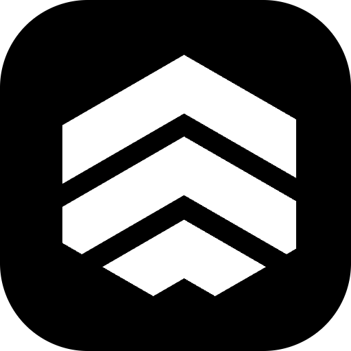

    

# Koyeb

This is a Raycast extension for [Koyeb](https://koyeb.com/).

## 🚀 Getting Started

1. **Install extension**: Click the `Install Extension` button in the top right of [this page](https://www.raycast.com/xmok/koyeb) OR `install` via Raycast Store

2. **Configure**: You will need to enter API Key from Koyeb Control Panel

---

Looking for more infra extensions? Try these:

