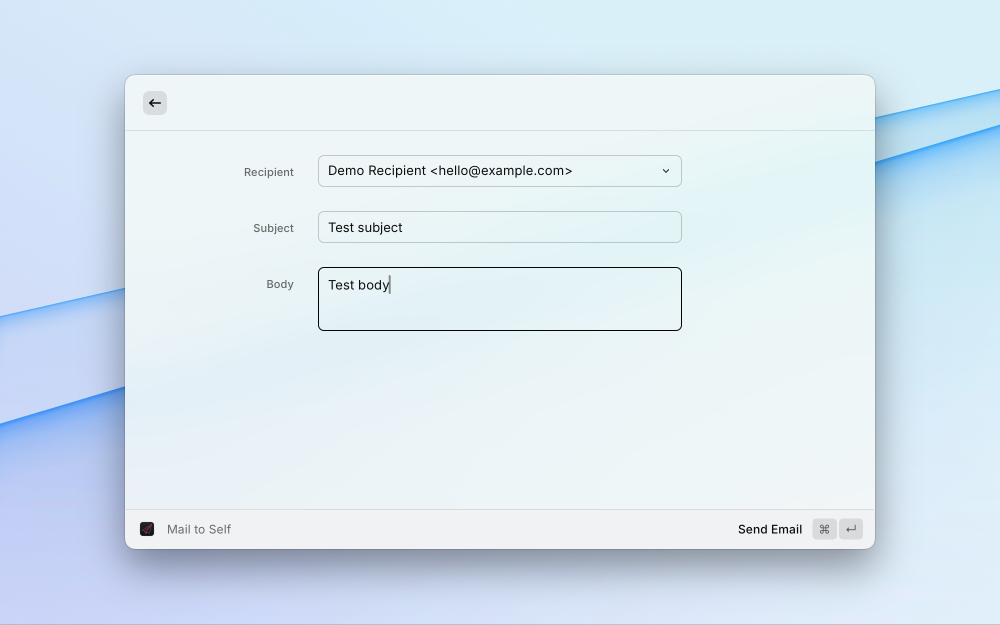

# Mail to Self

Send quick subject + body notes straight into your inbox via SMTP without leaving Raycast. I keep my inbox as an "informal task list", so this command makes capturing ideas frictionless.

## Features
- Prompts for subject and body inside a Raycast form so nothing breaks your flow.
- Failure toasts remind you to update the SMTP username/password in Raycast Preferences whenever authentication errors pop up. Those fields remain optional, so anonymous relays still work.
- Supports one or many recipients — list `address` entries in preferences and, when multiple exist, a dropdown appears to choose the destination.
- Works with any SMTP server (custom domain, Fastmail, Gmail app passwords, Proton Mail Bridge, etc.) thanks to configurable host, port, encryption, auth, and TLS validation behavior.
- Sender name defaults to "Mail to Self" but can be customised per workspace.

## Configuration
Open Raycast → `Extensions` → `Mail to Self` to configure:

| Preference | Notes |
| --- | --- |
| **SMTP Host / Port / Encryption** | Required for connecting to your provider. STARTTLS and implicit SSL/TLS are covered, along with a "None" fallback for local relays. |
| **TLS Certificate** | Enable the checkbox only when you have a trusted self-hosted server and need to accept self-signed certificates. |
| **SMTP Username / Password** | Optional. Leave them blank for anonymous relays, or populate them if your provider requires authentication. Stored as secure `password` / `textfield` entries exactly like the Mailtrap and Purelymail extensions. |
| **Sender Name / Email** | Defaults to `Mail to Self <sender@example.com>`. |
| **Recipients** | Provide a comma-separated list. Optional display names via `Jane Smith <jane@example.com>`. |

## Usage
1. Invoke the `Mail to Self` command from Raycast.
2. Pick a recipient (shown only when you have more than one configured), add a subject and body.
3. Press `⌘⏎` to send. The extension uses [`nodemailer`](https://nodemailer.com/about/) to talk to SMTP directly and surfaces any failures as Raycast toasts.
