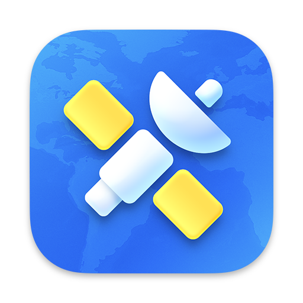

    

# NetNewsWire

This is an extension for [NetNewsWire](https://netnewswire.com/) - _a free and open source RSS reader for Mac, iPhone, and iPad_.

> NOTE: this extension requires the application to be installed.

## ➕ Looking for something else?

Try these:

