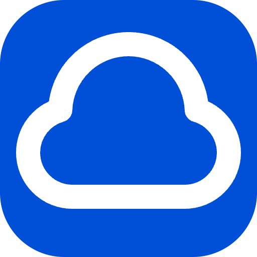

    

# OVHcloud

This is a Raycast extension for [OVHcloud](https://ovh.com/).

With this extension you can only _Manage_ **Domains** (for now).

## 🚀 Getting Started

1. **Install extension**: Click the `Install Extension` button in the top right of [this page](https://www.raycast.com/xmok/ovh) OR `install` via Raycast Store

2. **Prepare**:

    This extension uses official APIs and needs configuration. Refer to [First Steps with the OVHcloud APIs - OVHcloud](https://help.ovhcloud.com/csm/en-gb-api-getting-started-ovhcloud-api?id=kb_article_view&sysparm_article=KB0042784#:~:text=the%20language%20used.-,Advanced%20usage%3A%20pair%20OVHcloud%20APIs%20with%20an%20application,-Create%20your%20app) to learn where and how to get your keys.

    As reference:
    
    - `Navigate` to "API keys" in "Identity and Access Management (IAM)" (the exact link depends on your OVHcloud region but here is `CA` example: https://ca.ovh.com/manager/#/iam/api-keys)
    - `Click` on "Create an API key"
    - `Enter` Application name e.g. Raycast
    - `Enter` Application description e.g. Raycast Extension
    - `Select` Validity of your choice but choose 30 days or Unlimited unless you are comfortable rotating keys periodically
    - `Choose` Rights - if you are comfortable, you can set this as 
    
        | - | - |
        |---|---|
        | GET | * |
        | PUT | * |
        | POST | * |
        | DELETE | * |

        ... but this will give ALL permissions in your account.

        If you are not comfortable, you will need to specify the relevant endpoint's rights by referring to your region's endpoint reference. It is difficult to provide an example since the rights may not be uniform across regions.

3. **Configure**:

    - **OVH API Endpoint** - Choose the correct region
    - **Application Key** - Enter this from previous section
    - **Application Secret** - Enter this from previous section
    - **Consumer Key** - Enter this from previous section

## 🗒️ Note

There are a lot of items in OVHCloud. PRs are welcome but due to the complexity of the APIs e.g. some endpoints are only available in certain regions, it's recommended to open an `Issue` for discussion first.

## ❔

### **What's with the logo?**

OVHCloud has strict guidelines on usage of their Brand Assets so this is an alternative inspired by their Brand Colors. Feel free to make a PR if you have a better logo in mind 😅.

---

Looking for more infra extensions? Try these:

