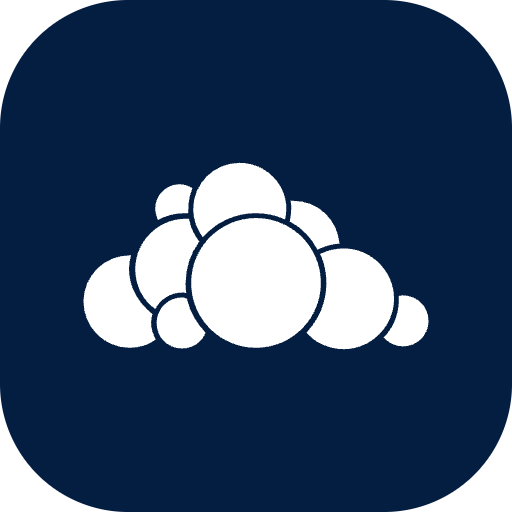

    

# ownCloud

This is a Raycast extension for [ownCloud](https://owncloud.com/). It allows you to search for files and folders in your ownCloud instance directly from Raycast.

## ⚙️ Configuration

- **URL**: The URL of your ownCloud instance.
- **Username**: Your ownCloud username.
- **Password**: Your ownCloud password.

## ➕ More

