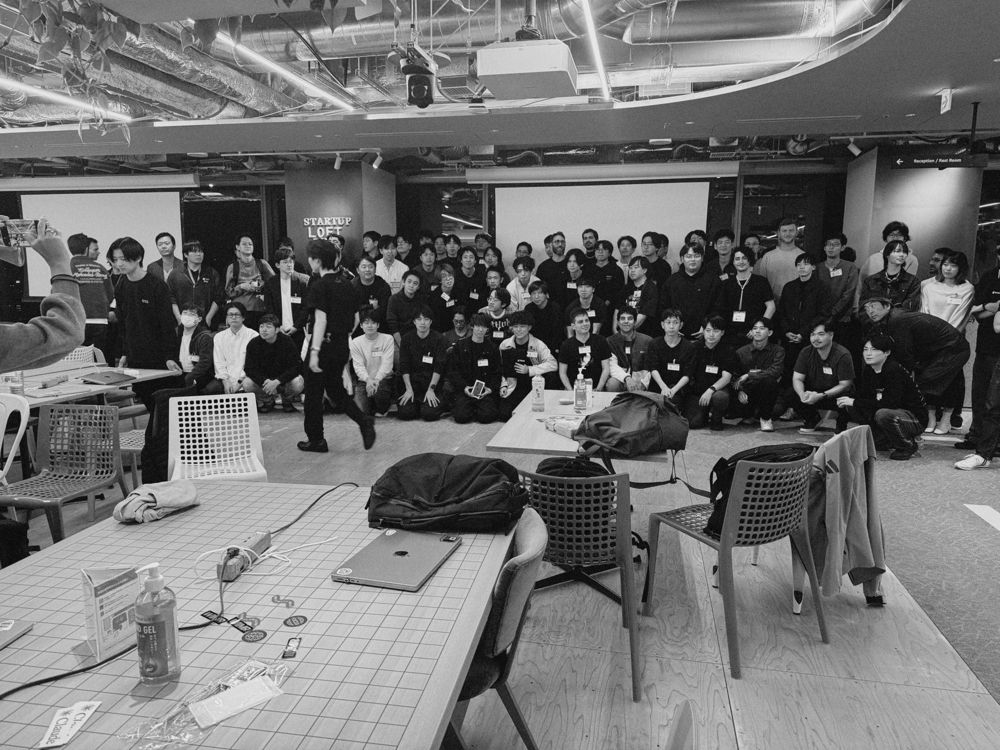

# Sound Search

Sound Search is a Raycast extension designed to help anyone—artists, creators, filmmakers, advocates, and more—quickly find the perfect sound or music sample for any purpose. Whether you're making videos, podcasts, campaigns, or just looking for creative inspiration, Sound Search enables you to discover quality samples from curated sources to fit your needs.

## Available Sources

### Soundraw

Get sounds from [Soundraw](https://soundraw.io), the 100% Copyright-Safe AI Music Generator, to increase your music creation workflow's productivity.

**ℹ️ Note**

Soundraw's API for sound search is currently in a closed beta. At this time, users cannot self-serve an API token. If you are a paid [Soundraw](https://soundraw.io) user and would like early access or have questions regarding this extension, please contact [Soundraw](https://soundraw.io)'s [customer support team](https://3jz3x.channel.io/workflows/704128).

**⚙️ Preferences**

- API Token (required)
- API Url (required)

## Feature Requests

Want support for a new data source or sample provider? Please request it in the [GitHub Discussions section](https://github.com/clins1994/sound-search/discussions) for this extension!

Alternatively, you are welcome to open a pull request with any new integration. All ideas are welcome!

Can't promise but I'll do my best to add some more sources. Any help will be very much appreciated 🤗

## Author

Created by Caio Lins ([@clins1994 on GitHub](https://github.com/clins1994)).

Special thanks to Ravi ([@perfectbase on GitHub](https://github.com/perfectbase)), who helped me implement the core features during the [Tokyo AI Hackathon](https://raycast.connpass.com/event/369928/) organized by [Raycast](https://github.com/raycast), [Anthropic](https://github.com/anthropics), [Vercel](https://github.com/vercel), and [Supabase](https://github.com/supabase) on October 30th, 2025.

## Repository

- Origin PR: https://github.com/raycast/extensions/pull/22590
- Origin repo: https://github.com/clins1994/sound-search

## License

Distributed under the MIT License
